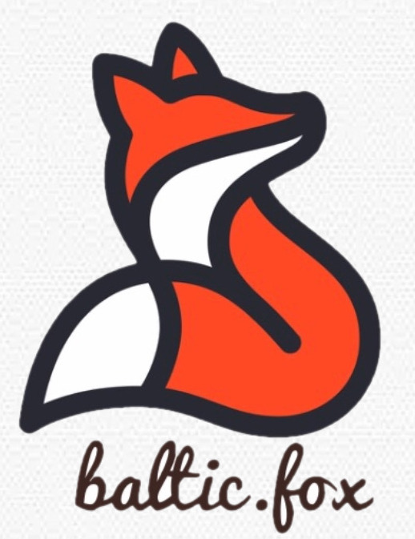

# Ольга Старикова

* Знание налогового законодательства, бухгалтерского и налогового учёта.
* Умение разрабатывать финансово-экономические модели.
* Опыт анализа, планирования и регламентации финансово-хозяйственной деятельности.
* Навык планирования и контроля исполнения бюджетов.
* Знание видов себестоимости, методов ценообразования.
* Опыт составления аналитических отчётов.
* Готовность к профессиональному росту.
* Ориентация на достижение конкретных показателей и постановке задач на их улучшение.